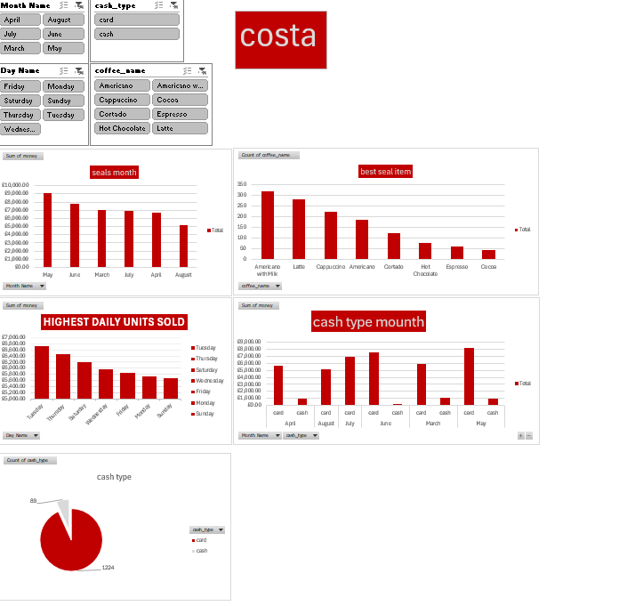

# ☕ Costa Coffee Sales & Performance Dashboard

## 📌 Project Overview
An interactive sales performance and revenue analytics dashboard built in **Microsoft Excel**. The project analyzes transactional coffee shop data to extract actionable business insights regarding revenue trends, best-selling products, and customer payment behaviors using **Power Query** and dynamic **Pivot Tables**.

---

## 📊 Dashboard Overview

---

## 💡 Key Business Insights
* **Peak Sales Periods:** Analyzed daily and monthly revenue distribution to identify top-performing business hours and days.
* **Top Revenue Drivers:** Identified best-selling beverages (such as Americano with Milk and Latte) contributing to the majority of total sales volume.
* **Payment Preference:** Tracked payment distribution (Card vs. Cash) to understand customer transaction behavior.

---

## 🛠️ Tools & Technical Workflow
* **ETL & Data Cleaning:** Power Query (handling missing values, data type casting, date extraction).
* **Data Modeling & Summarization:** Dynamic Pivot Tables, Custom Calculated Fields.
* **Visualization & Interactivity:** Pivot Charts, Dynamic Slicers (Month, Day, Beverage Type, Payment Method).
